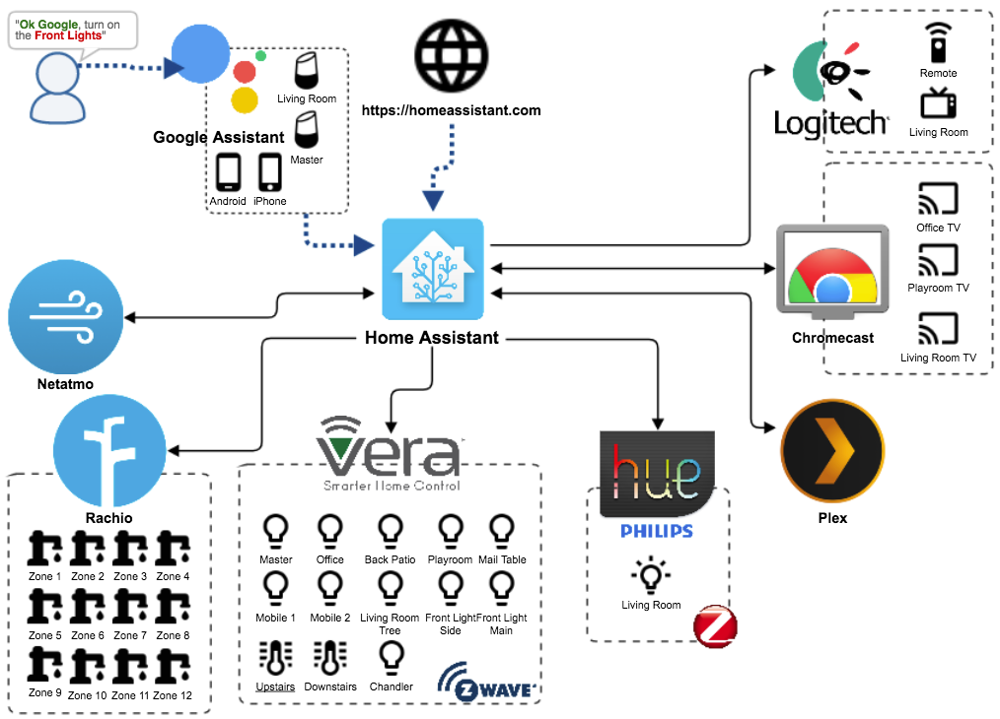

# Home Assistant Configuration

Home Assistant is an open-source home automation platform running on Python 3. Track and control all devices at home and automate control. I have mine running on with HASSIO on a Raspberry Pi 3, but will be integrating it into a Docker Service across a Swarm of 6 Pi's for redundancy in future iterations. This repository represents my configureation files to make my Home Automation magic happen. I run a CICD pipeline w/ Travis CI successes being pushed to my 'production Pi'.

## Home Assistant Components Used

**CONTROLLED COMPONENTS**
- Philips Hue
- Vera
- Rachio
- Arduino

**INPUT COMPONENTS**
- Google Home
- IFTTT
- Netamo

**NOTIFICATION COMPONENTS**
- Slack
- Pushbullet
- Cisco Webex Teams

**MEDIA COMPONENTS**
- Google Chromecast
- Apple TV

## Routines
| TITLE | HOW TO EXECUTE | DESCRIPTION |
|---|---|---|
| Morning | I'm up / Good Morning | Execute Morning Scene |
| Going to bed | I'm going to bed | Execute Goodnight Automation |
| In Bed | I'm in bed / Goodnight | Execute **INSIDE LIGHTS OFF** Scene
| Fresca Hours | Sandra's still working | Execute **FRESCA SCENE** |
| Leaving | I'm leaving | Turn all lights off, set Upstairs and Downstairs to 85 | 

## Scenes
| TITLE | DESCRIPTION |
|---|---|
| Morning Scene | Set morning lights |
| Goodnight Scene | Turn off all **INSIDE LIGHTS** except MASTER |
| Inside Lights Off | -30m Sunrise | Turn off **OUTSIDE LIGHTS** |
| Inside Lights On | -30m Sunrise | Turn off **OUTSIDE LIGHTS** |
| Fresca Scene | Turn off all **INSIDE LIGHTS** FRESCA Lamp |

## Automations and Triggers
| TITLE | TRIGGER | DESCRIPTION |
|---|---|---|
| Auto Lights | -30m Sunset | Turn on **INSIDE LIGHTS** |
| Evening Lights | +10m Sunset | Turn on **OUTSIDE LIGHTS** |
| Sunrise Lights | -30m Sunrise | Turn off **OUTSIDE LIGHTS** |
| Morning | Morning Routine | **MORNING SCENE**, Boil water kettle, Broadcast: "Good Morning"
| Goodnight | G2B Routine | **GOODNIGHT SCENE**, Turn off TV, Broadcast: "Goodnight" |

## Inspiration and Support

- [Instagraeme](https://github.com/Instagraeme/Home-Assistant-Configuration/raw/master/HomeAssistant.gif)
- [Dale3h](https://github.com/dale3h/homeassistant-config)
- [Teagan42](https://github.com/Teagan42/HomeAssistantConfig)
- [CBulock](https://github.com/cbulock/home-assistant-configs)
- [chrom3](https://github.com/chrom3)

Thanks to all the people in the [gitter](https://gitter.im/home-assistant/home-assistant) community for listening and help

And thanks to *all* the devs that create the Home Assistant magic
